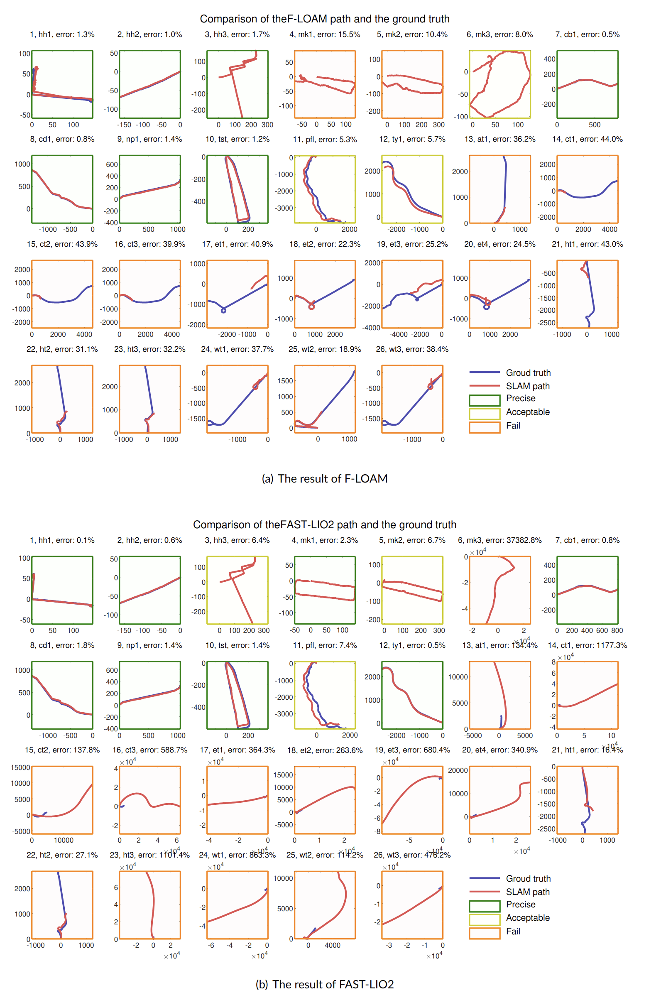

# HK_MEMS_Dataset
HK-MEMS, a MEMS LiDAR dataset on urban tunnels and dynamic scenarios

# Updates
- 1/9/2024, this repo is opened. Sample data is provided. ([Sample_data_download](https://1drv.ms/f/s!AoYF4x3O8uR9g6xkP0XRGdjlE7QinQ?e=Lsf5gY), password: HK_MEMS_Dataset). The full dataset will be released after revision according to the review feedback.

# Introduction
This paper presents a multimodular dataset, HK-MEMS, incorporating data from MEMS LiDARs, a camera, GNSS, and Inertial Navigation Systems. To our best knowledge, it is the first dataset to offer **automotive-grade MEMS LiDAR** data on urban roads for research in Simultaneous Localization and Mapping (SLAM).

This dataset emphasizes **extreme environments** like degenerate urban **tunnels** and **dynamic** scenarios, aiming to enhance the robustness of SLAM systems.

We collect 187 minutes and 75.4 kilometers of data. State-of-the-art SLAM methods are evaluated on this benchmark. The result highlights the challenges in extreme environments and underscores the ongoing need to enhance **the robustness of SLAM systems**.
This dataset serves as a valuable platform for exploring the potential and limitations of MEMS LiDAR, and a challenge to enhance the robustness of SLAM in urban navigation scenarios.

# Configuration

## Sensors

The sensor suite in our dataset:

- A Robosense M1 MEMS LiDAR
- A 32-beam Ouster OS1-32 mechanical LiDAR
- A RealSense L515 LiDAR (used as a camera in outdoor environments)
- A Xsens MTI-30 IMU
- A CUAV V5+ flight controller (used as INS system) with RTK-GPS
- An Intel NUC mini computer.

  

[//]: # (Main functions and measurements of each sensor:)

## Platforms

- Handheld platform
- Mobile robot
- Buses

  

# Scenarios

This dataset concentrates on the typical and challenging scenarios in urban mapping and localization.
It can serves as a benchmark platform for investigating issues such as **degenerate structure, high-speed motion, dynamic noise, and altitude drift**.

  

Main features and challenges of 26 sequences and three groups:

  

## Dyna-pedestrian group
6 sequences in densely populated residential zones;
- HH1: mapping the HK Coliseum with minimal dynamic objects, handheld, easy;
- HH2 and HH3: degenerate subway passages or footpaths, mobile robot, moderate.
- MK1-3: many dynamic objects that are very close to the sensors, handheld, challenging; 
## Dyna-vehicle group
6 sequences gathered on urban roads, the platform are buses.
- Low-speed sequences (CB1, CD1, NP1, TST1) in commercial areas, easy;
- High-speed sequences in suburban locales (PFL1) and cargo terminals (TY1), moderate.

Images from the Dyna-pedestrian and Dyna-vehicle groups:

  

## Tunnel group
14 sequences recorded within 5 tunnels located beneath the sea or mountains. Multiple recordings for each tunnel are provided, showcasing varying times, weather conditions, traffic volumes, and directions. Challenging.

Images from the Tunnel group :

  

# Groud Truth
- **RTK-**. provides precise 3D position measurements with centimeter-level accuracy.
  (HH1, HH2)

  

- **Bus Route data**. In sub-terrain tunnels or urban canyons with poor GPS signal, reliable trajectory references can be derived from the bus route data from the government.
  (Dyna-vehicle group and Tunnel group)

  

- **Altitude**
altitude references are established through smoothed air pressure readings from the barometer integrated within the CUAV V5+ INS system.

  

- If GPS and bus route data are unavailable, the start to end drift is used for evaluation (HH3, MK1-3).

# Evaluation

## Evaluated SLAM
We adapted and tested several SLAM methods to the MEMS LiDAR in this dataset, including:
- F-LOAM: LO, point-based, need to modify the feature extraction 
- SLAMesh: LO, model-based, no modification needed.
- FAST-LIO2: LIO system, filter-based, no feature extraction needed.
- LIO-SAM: LIO system, factor-graph-based, need to modify the feature extraction.
  
In LIO systems, notice that the timestamp of each frame of the point cloud in M1 LiDAR is the time when the last point is collected.

To record pose in tum format, you can use https://github.com/RuanJY/evaluater

## Localization accuracy:

The reference bus routes path and the sensor data used in SLAM are collected in different and coordinate frames.
We align the two paths first and then compute a metric called Relative Root mean Square Error (RRMSE).

- The Dyna-vehicle group shows the lowest errors.
- The MK1-3 sequences presents significant challenges.
- The Tunnel group exhibits the highest error.

  

Comparison of trajectories estimated by SLAM (red paths) and the ground truth path (blue path) in the HK-MEMS dataset.

SLAM performance is classified as
- Failed, RRMSE > 10\% (orange border),
- Acceptable, 5\% < RRMSE < 10\% (yellow border),
- Precise, RRMSE < 5\% (green border).

  

[//]: # (### evo)

[//]: # (https://github.com/MichaelGrupp/evo)

[//]: # (### rpg)

[//]: # (https://github.com/uzh-rpg/rpg_trajectory_evaluation)

[//]: # (### traj_plot from FusionPortale)

[//]: # (https://github.com/fusionportable/fusionportable_dataset_tools/tree/main/tools/traj_plot)

[//]: # (### self-defined method based on bus routes)

[//]: # (need to be developed)

[//]: # ()
[//]: # (## Mapping evaluation: )

[//]: # (### map quality from fusionportable_dataset_tools &#40;RMSE of RE, COM, CD, with ground truth&#41;)

[//]: # (https://github.com/fusionportable/fusionportable_dataset_tools/tree/main/evaluation/map_evaluation)

[//]: # ()
[//]: # (### map entropy from Pointcloud Evaluation Tool &#40;without ground truth&#41;)

[//]: # (https://github.com/AIS-Bonn/pointcloud_evaluation_tool)

# Acknowledgement

The authors would like to thank the kind assistance from Yibo Wang, Guangzhi Tian, and Zhuoyuan Liu, who help to build the hardware system. 
